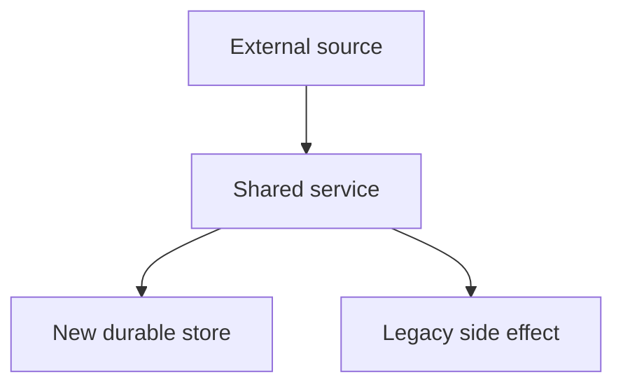

# /ctx-docs — Architecture Checkpoint Documentation

Create a human-readable checkpoint doc for completed technical work. The goal is to preserve the current system boundary: what changed, why it matters, how it works, how to verify it, and what remains.

Do not default to Linear or issue aggregation. Treat code, migrations, tests, and existing docs as the primary evidence.

---

## 1. Define The Checkpoint

Start by naming the completed slice in plain language:

- `auth-identity-postgres-task-3`
- `billing-postgres-cutover`
- `playbook-runtime-v1`
- `company-list-postgres-phase-1`

If the user did not give a title, derive one from the current branch, changed files, or the user's wording.

Use one doc unless the user asks for a full documentation package. Put the doc near existing related docs:

- feature docs under the local app docs directory when one exists, e.g. `src/coreties-app/docs/`
- project-wide docs under `docs/`
- diagrams under a colocated `diagrams/<checkpoint-name>/` directory when standalone Mermaid files are useful

Do not commit unless the user explicitly asks.

---

## 2. Gather Evidence

Read narrowly, then expand only as needed. Prefer `rg` and targeted file reads.

Minimum evidence set:

- existing docs related to the same feature, migration, or architecture area
- changed or referenced service files
- changed or referenced API entrypoints
- relevant migrations or schema definitions
- relevant tests
- current git status

For migration/source-of-truth work, explicitly find:

- current source of truth
- previous source of truth
- write paths
- read paths
- fallbacks or dual-write behavior
- compatibility side effects
- verification commands
- remaining migration boundary

If an older doc conflicts with current code, state the current code-backed boundary and mention the doc gap.

---

## 3. Write The Doc

Use this structure by default. Omit sections only when they genuinely do not apply.

````markdown
# <Checkpoint Title>

This document summarizes <completed slice> and relates it to the existing docs.

## Status

{What is now true. Include exact boundary language.}

## Why This Exists

{Problem before the change and why the new boundary is useful.}

## Data Model

{Tables, contracts, schemas, durable ids, source keys, or state objects.}

## Runtime Write Path

{Who writes what, in what order, and transaction/side-effect boundaries.}

## Entry Points Updated

| Path | Role |
| --- | --- |
| ... | ... |

## Reader Behavior

{What reads the new source first, what falls back, and what remains legacy.}

## What Changed About <Legacy System>

{Be explicit about what did not disappear. Name fallbacks and side effects.}

## Verification

{Focused tests, manual SQL/API checks, and behavioral checks.}

## Remaining Migration Boundary

{What is intentionally not done yet.}
````

### Boundary Language Rules

- Do not write "migrated" without naming the migrated slice.
- Do not imply the whole product is on the new architecture unless the evidence proves it.
- Separate authentication source, app identity source, analytics source, billing source, and workflow state source when those are different.
- Name legacy fallbacks directly.
- Name compatibility side effects directly.
- Prefer "Postgres-owned for these updated paths" over broad claims like "Postgres-only."

---

## 4. Add Mermaid Diagrams

For system-boundary docs, include both embedded Mermaid blocks in the markdown and standalone `.mmd` files when useful.

Default diagrams:

1. **Runtime flow**: request/event -> service -> transaction -> tables/side effects
2. **Entrypoint map**: routes/jobs/events -> shared service -> stores
3. **Reader boundary**: new source -> fallback -> behavior
4. **Before/after ownership**: old source vs new source when the migration is confusing

Use diagrams to clarify ownership and flow. Do not add decorative diagrams.

Standalone file convention:

```text
<docs-dir>/diagrams/<checkpoint-name>/runtime-flow.mmd
<docs-dir>/diagrams/<checkpoint-name>/entrypoints.mmd
<docs-dir>/diagrams/<checkpoint-name>/reader-boundary.mmd
```

Keep Mermaid syntax simple:



---

## 5. Verify The Documentation

Before reporting back:

- confirm the doc file exists
- confirm any standalone `.mmd` files exist
- re-read the generated doc for overclaims
- check that links point to real local files where practical
- run a focused search for the main terms to ensure the doc names the actual code paths
- report verification commands run

Do not claim tests pass unless you ran the tests. For docs-only changes, file existence, content checks, link sanity, and git status are usually the right verification.
